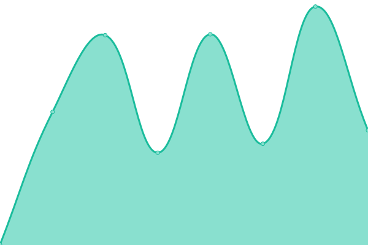
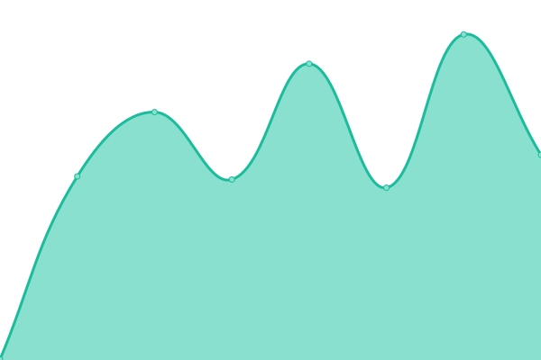
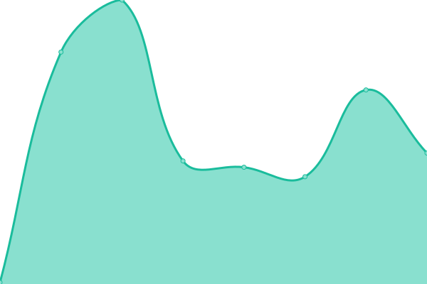
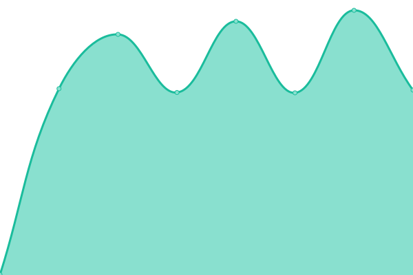
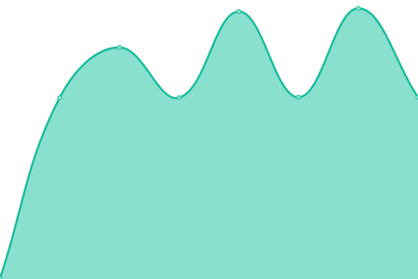

# [📈 Live Status](https://status.perscom.io): <!--live status--> **🟧 Partial outage**

This repository contains the open-source uptime monitor and status page for [Deschutes Design Group LLC](https://www.deschutesdesigngroup.com), powered by [Upptime](https://github.com/upptime/upptime).

With [Upptime](https://upptime.js.org), you can get your own unlimited and free uptime monitor and status page, powered entirely by a GitHub repository. We use [Issues](https://github.com/DeschutesDesignGroupLLC/PERSCOM-3.0-Status/issues) as incident reports, [Actions](https://github.com/DeschutesDesignGroupLLC/PERSCOM-3.0-Status/actions) as uptime monitors, and [Pages](https://status.perscom.io) for the status page.

<!--start: status pages-->
<!-- This summary is generated by Upptime (https://github.com/upptime/upptime) -->
<!-- Do not edit this manually, your changes will be overwritten -->
<!-- prettier-ignore -->
| URL | Status | History | Response Time | Uptime |
| --- | ------ | ------- | ------------- | ------ |
|  [Website](https://www.deschutesdesigngroup.com) | 🟩 Up | [website.yml](https://github.com/DeschutesDesignGroupLLC/System-Status-Monitor/commits/HEAD/history/website.yml) | 

 414ms
     
 | 

<a href="https://status.deschutesdesigngroup.com/history/website">100.00%</a>
    

|  [Community Forums](https://community.deschutesdesigngroup.com) | 🟩 Up | [community-forums.yml](https://github.com/DeschutesDesignGroupLLC/System-Status-Monitor/commits/HEAD/history/community-forums.yml) | 

 730ms
     
 | 

<a href="https://status.deschutesdesigngroup.com/history/community-forums">100.00%</a>
    

|  [Support Desk](https://support.deschutesdesigngroup.com/hc/en-us) | 🟥 Down | [support-desk.yml](https://github.com/DeschutesDesignGroupLLC/System-Status-Monitor/commits/HEAD/history/support-desk.yml) | 

 123ms
     
 | 

<a href="https://status.deschutesdesigngroup.com/history/support-desk">0.00%</a>
    

|  [Client Control Panel](https://solutions.deschutesdesigngroup.com) | 🟩 Up | [client-control-panel.yml](https://github.com/DeschutesDesignGroupLLC/System-Status-Monitor/commits/HEAD/history/client-control-panel.yml) | 

 563ms
     
 | 

<a href="https://status.deschutesdesigngroup.com/history/client-control-panel">100.00%</a>
    

|  [Authentication Services](https://solutions.deschutesdesigngroup.com) | 🟩 Up | [authentication-services.yml](https://github.com/DeschutesDesignGroupLLC/System-Status-Monitor/commits/HEAD/history/authentication-services.yml) | 

 478ms
     
 | 

<a href="https://status.deschutesdesigngroup.com/history/authentication-services">100.00%</a>
    

<!--end: status pages-->

[**Visit our status website →**](https://status.perscom.io)

## 📄 License

- Powered by: [Upptime](https://github.com/upptime/upptime)
- Code: [MIT](./LICENSE) © [Deschutes Design Group LLC](https://www.deschutesdesigngroup.com)
- Data in the `./history` directory: [Open Database License](https://opendatacommons.org/licenses/odbl/1-0/)
